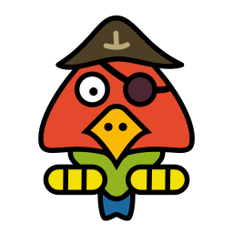

# Parrot - Simple dialog plugin for Godot

## Introduction

*Parrot* is a plugin for Godot that allows for voice-enabled, subtitled dialogs between characters in story-driven games. It is used, for example, together with the [EgoVenture](https://github.com/deep-entertainment/egoventure) plugin and is used by MDNA games for their Carol Reed series of games since 2021.

Parrot is (at least currently) only used for **playing** dialogs, it does not include branching dialog management for example.

Features:

* Plays dialogs with multiple lines by multiple, color-coded characters

* Subtitle-Support

* Voice-Support

* Dialogue-Import from CSV files

## Documentation

* [Dialogs, lines and characters](docs/resources.md)

* [Dialog import](docs/import.md)

* [Theming](docs/theming.md)

* [API-Docs](docs/api)

## Development

If you find bugs or need more features, please [file an issue within this repository](https://github.com/deep-entertainment/parrot/issues). 

As this framework is used internally at Mdna Games, we'll have to consider each new feature.

If a new feature doesn't match or contradicts our needs, we might refuse to accept it, but welcome you to fork this repository and implement it yourself.

You're welcomed to open pull requests about bugs or (confirmed) features any time and we'll review it and might ask you for modifications. Thank you for your work!

## Logo

Logo based on ["Pirate Parrot" by Klàro on OpenClipart](https://openclipart.org/detail/244587/pirate-parrot)
