# Getting started

## Preparations

*Parrot* is used to play *dialog lines* spoken by *characters* in a *dialog*. So as an author, you should prepare a list of characters, assign individual colors to them to distinquish the subtitles and group lines into dialogs.

It's recommended to group all characters in their own folder for ease of management. As dialogs are used quite often in narrative games, the number of dialogs can also grow quite big, so a separate folder for dialogs is recommended, maybe even use subfolders to group the dialogs even more to find them later.

*Parrot* also supports voice-enabled dialogs and the voice files need to be grouped into a folder as well. Also, the voice files have special filenames as described in [Dialogs, lines and characters](resources.md).

Also, obviously, *Parrot* needs to be installed (if it isn't already, for example in the [EgoVenture Game Template](https://godotengine.org/asset-library/asset/905)). To do this, change to the AssetLib tab and search for *Parrot*:

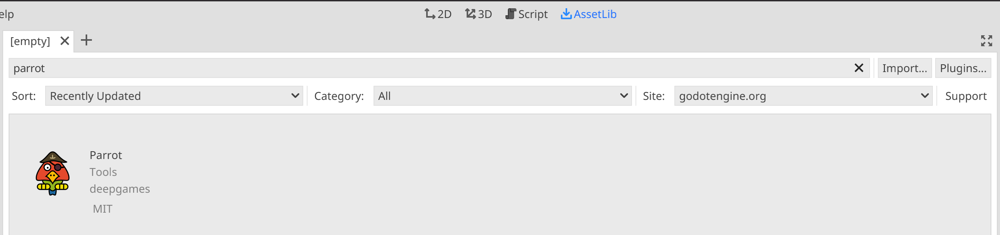

Click on the addon to show an info screen:

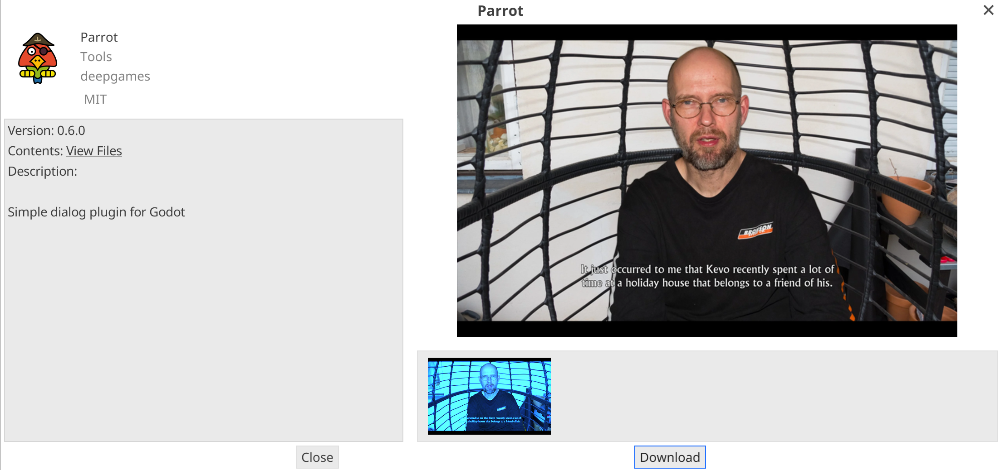

Click *Download* and wait for the asset to be downloaded:

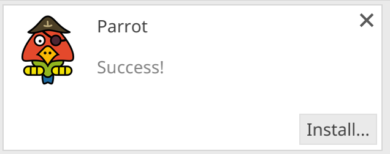

Click on *Install...* and uncheck the first checkbox and only check the *addons*-folder after all:

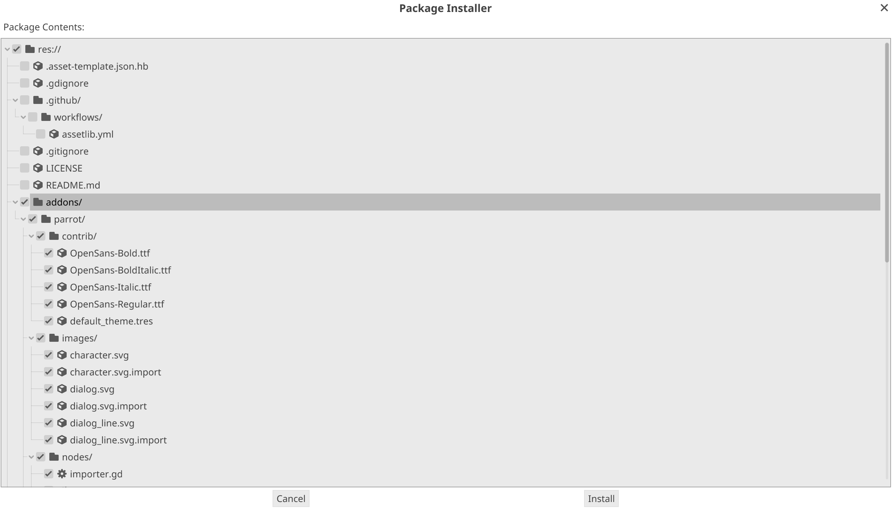

Click on *Install*.

Go into the project settings, select the *Plugins* tab and enable Parrot:

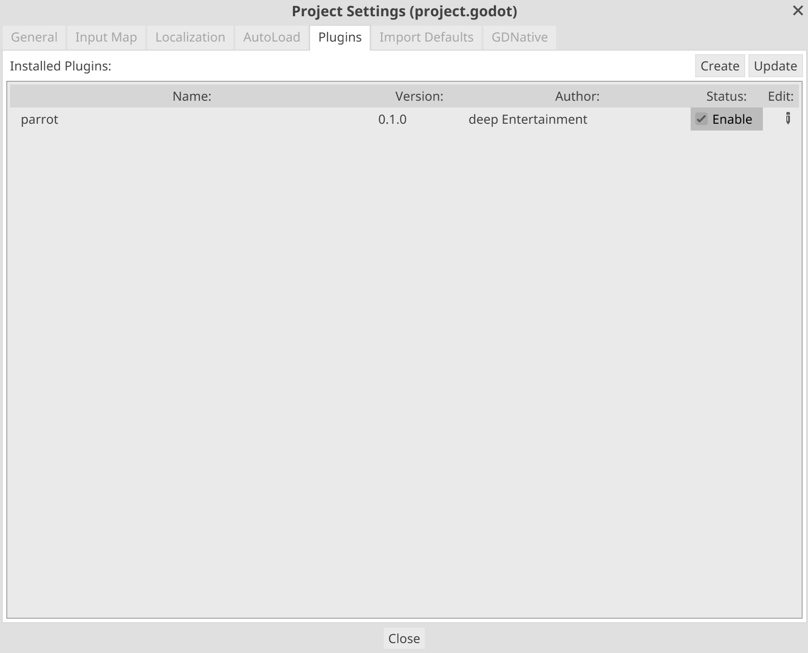

## Creating characters

Right click on the folder you want to store the characters in and select *New Resource*:

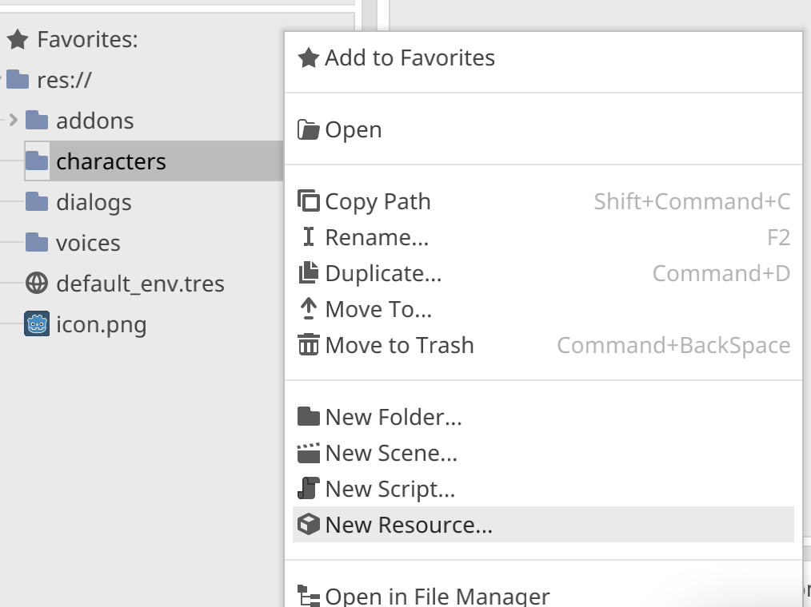

Search for character and select the CharacterResource:

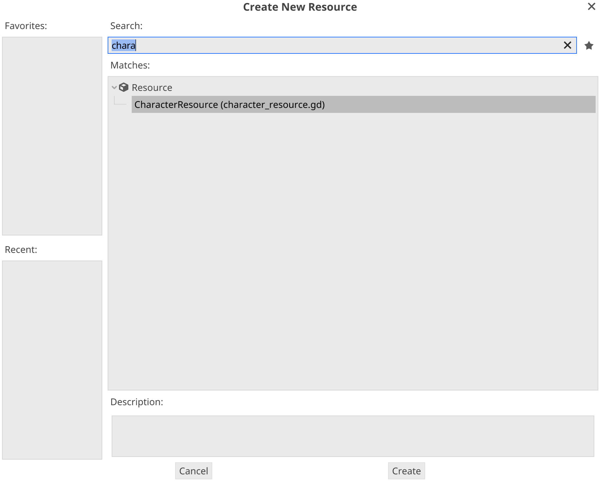

Click *Create*. Enter the name of the new resource (the name of the character for example) and click save:

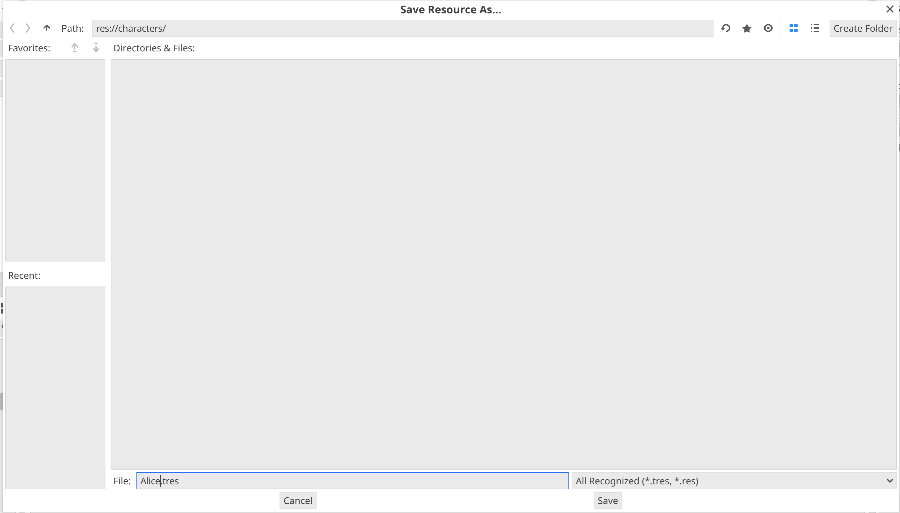

In the inspector on the right side, configure a name and a color for your character:

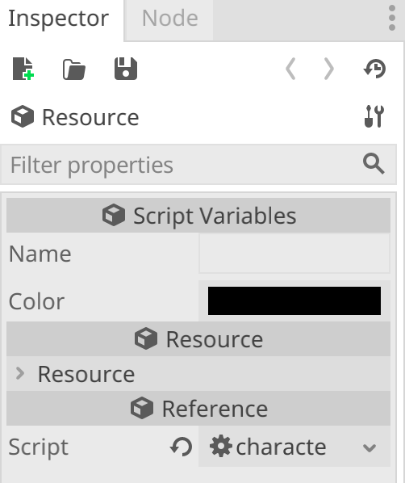

Click on the save symbol to save the changes.

## Creating dialogs

After you created all the required characters, it's time to create a dialog.

In the same way as creating a character, this time you create a new resource and select *DialogResource*:

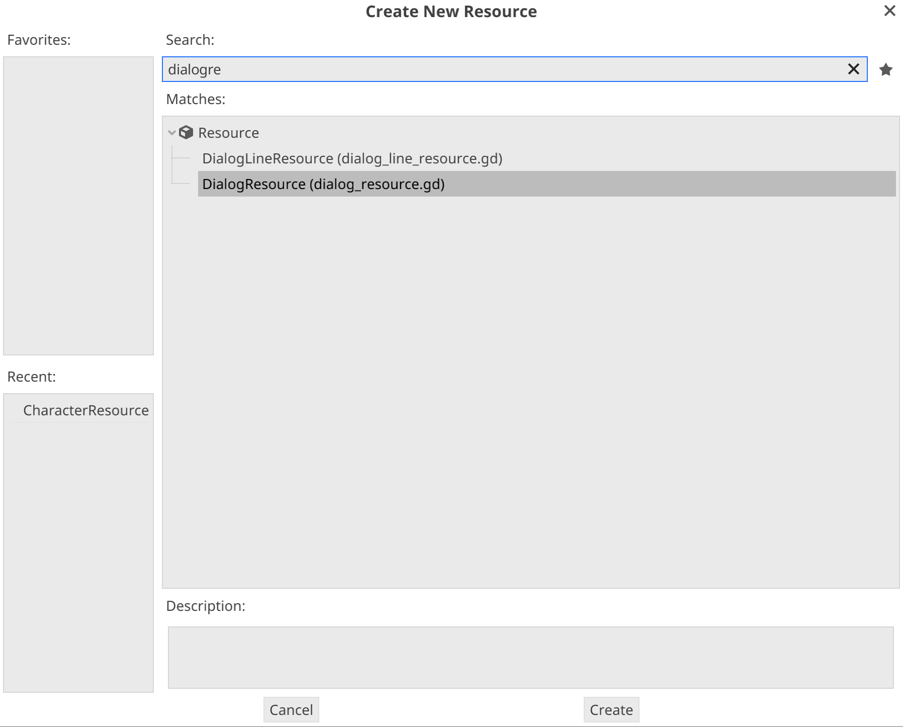

After setting a fitting name for the dialog, check out the inspector on the left

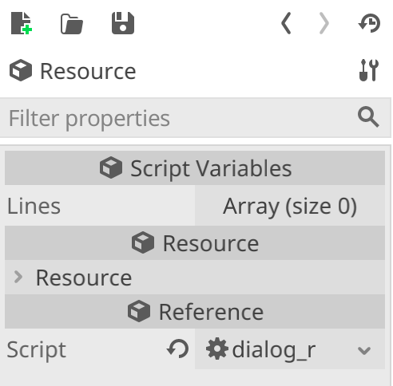

Dialogs are basically just a list of lines, that are played one after another. Internally, these lines are counted from 0 and matter when storing the relevant voice files for the lines. For the first line for a dialog called `alice_bob.tres` *Parrot* expects a voice file named `alice_bob_0.ogg` in the `voices` folder.

To add new lines, change the size of the list by clicking on *Array (size 0)* and then set *Size* to 1:

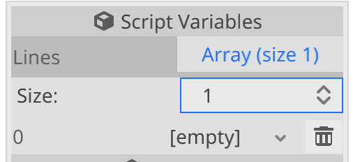

Every new item in the list you'll see `[empty]`. If you click on that you can select *New DialogLineResource*:

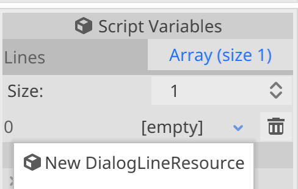

After selecting the item again, you see the configuration of the specific dialog line:

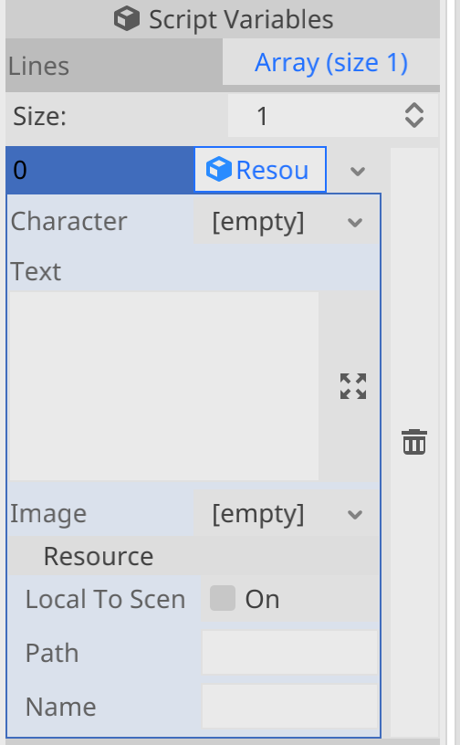

Load the character resource you previously created in "Character" and enter the text that character should say.

Additionally, you can select an image that will be displayed when that line is spoken. That way you can add images or even animations and enhance your dialogs visually.

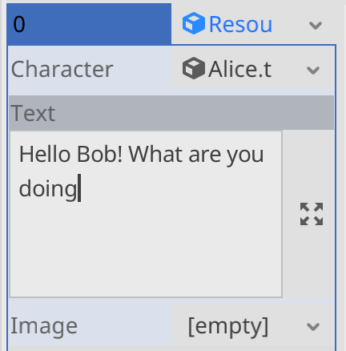

Add the other lines one after another to fill your resource.

## Playing the dialog

To play a dialog, you simply run `Parrot.play(preload("res://dialogs/alice_bob.tres"))` from your GDScript code.

You can connect the `dialog_finished` or `dialog_line_finished` of `Parrot` to get notified when a dialog or a single dialog line was finished.