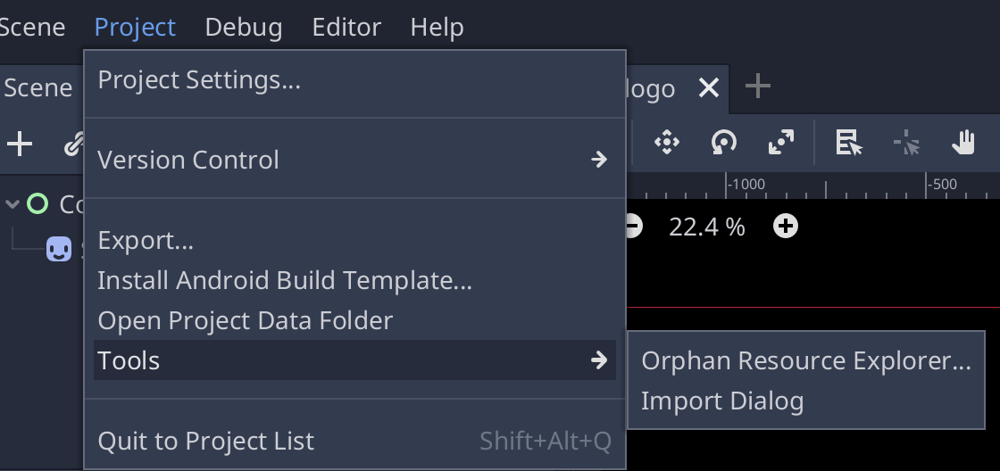

# Dialog import

Creating `Dialog` resources can be tedious, especially in a big game. Also, if you're working with voice actors, you need a better format to supply them with their lines.

That's why *Parrot* includes a dialog import, that automatically creates `Character`, `DialogLine` and `Character` resources from CSV files.

The format of these CSV files can be taken from [the included template file](addons/parrot/template.txt).

After filling the CSV files with all the required lines, start the dialog import feature from the Project/Tools menu:

After that, select the dialog csv file and then the path where the importer should generate all required dialogs, lines and character resources.

If you need to import the CSV again, remove the generated resources first and rerun the process.
